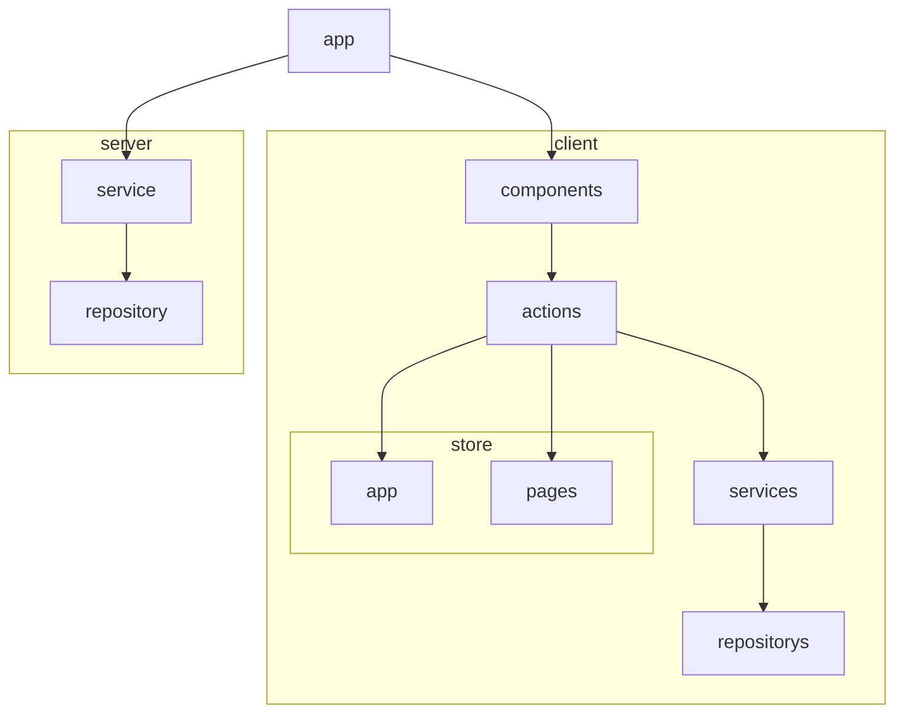

```mermaid
graph TD
  App[app]

  subgraph Client[client]
    CComp[components]
    CAct[actions]
    CSvc[services]
    CRepo[repositorys]
    subgraph CStore[store]
      CStoreApp[app]
      CStorePages[pages]
    end
  end

  subgraph Server[server]
    SSvc[service]
    SRepo[repository]
  end

  %% 許可される導線（明示ルール）
  App --> CComp
  App --> SSvc
  CComp --> CAct
  CAct --> CSvc
  CSvc --> CRepo
  CAct --> CStoreApp
  CAct --> CStorePages
  SSvc --> SRepo
```