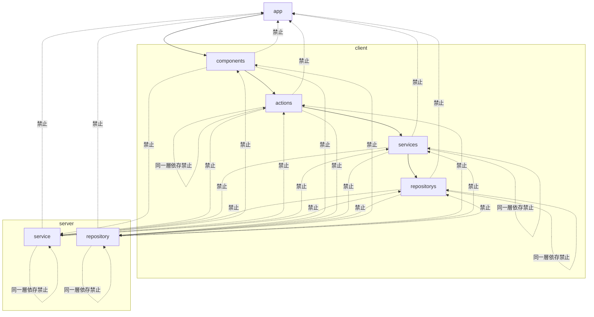

```mermaid
graph TD
  App[app]

  subgraph Client[client]
    CComp[components]
    CAct[actions]
    CSvc[services]
    CRepo[repositorys]
  end

  subgraph Server[server]
    SSvc[service]
    SRepo[repository]
  end

  %% 許可される依存
  App --> CComp
  CComp --> CAct
  CAct --> CSvc
  CSvc --> CRepo

  %% client -> server 禁止
  CComp -. 禁止 .-> SSvc
  CComp -. 禁止 .-> SRepo
  CAct -. 禁止 .-> SSvc
  CAct -. 禁止 .-> SRepo
  CSvc -. 禁止 .-> SSvc
  CSvc -. 禁止 .-> SRepo
  CRepo -. 禁止 .-> SSvc
  CRepo -. 禁止 .-> SRepo

  %% server -> client 禁止
  SSvc -. 禁止 .-> CComp
  SSvc -. 禁止 .-> CAct
  SSvc -. 禁止 .-> CSvc
  SSvc -. 禁止 .-> CRepo
  SRepo -. 禁止 .-> CComp
  SRepo -. 禁止 .-> CAct
  SRepo -. 禁止 .-> CSvc
  SRepo -. 禁止 .-> CRepo

  %% app 配下への import 禁止
  CComp -. 禁止 .-> App
  CAct -. 禁止 .-> App
  CSvc -. 禁止 .-> App
  CRepo -. 禁止 .-> App
  SSvc -. 禁止 .-> App
  SRepo -. 禁止 .-> App

  %% 同一レイヤー依存禁止
  CAct -. 同一層依存禁止 .-> CAct
  CSvc -. 同一層依存禁止 .-> CSvc
  CRepo -. 同一層依存禁止 .-> CRepo
  SSvc -. 同一層依存禁止 .-> SSvc
  SRepo -. 同一層依存禁止 .-> SRepo
```